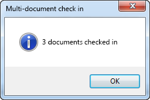
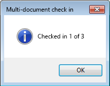
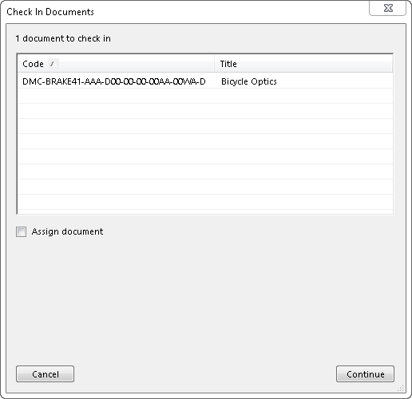
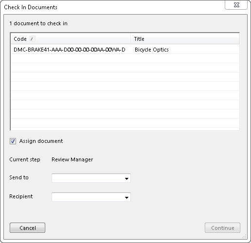
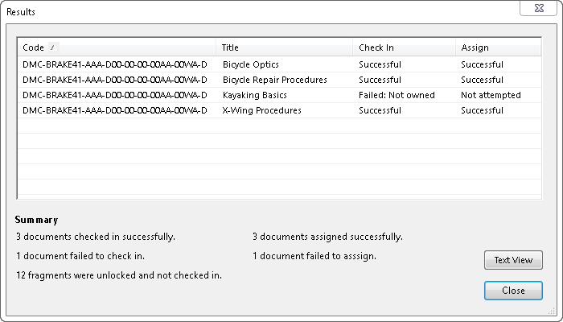

# Check In for Boeing S1000DauthorPro

## Background

[Boeing S1000DauthorPro](https://www.boeingservices.com/boeing-spectrum/){target="_blank"} is an authoring plug-in for [Arbortext](https://www.ptc.com/en/products/arbortext){target="_blank"}. The plug-in was written in java and xml and supports checking documents in and out of S1000Dmanager (a document management tool that supports sending documents through workflows as they are authored) as well as assisting authors in complying with the [S1000D authoring specification](https://s1000d.org/){target="_blank"}.

## The Problem

The current check in process is laborious and confusing. To check in a single documents requires upwards of 7 clicks through 7 dialogs, and this is multiplied for every document to check in as the process must be completed for each document.

- <figure markdown="span">
      
    <figcaption>Multi document check in screen, results version. Reads 3 documents checked in</figcaption>
  </figure>

- <figure markdown="span">
      
    <figcaption>Multi document check in screen. Reads Checked in 1 of 2</figcaption>
  </figure>

## Understanding the Users

User research sessions were held to interview the users to get an idea of how they were using the check in process. This included questions like:

- How many documents do you check in?
- How often do you check in documents?
- What issues have you encountered using check in?
- What do you like and not like about the current check in system?

Through these sessions, I found that the users were primarily authors, who would be working in arbor text then checking in documents as they finished. This could mean anywhere between one and five documents at a time around two to three times a week.

Once they were done with a document, they would then have to sign into S1000Dmanager (the sister application) to assign the document to the next person in the workflow, often a reviewer.

## Final Design

The check in process was streamlined to reduce the the process to 4 clicks total (not including document multi-selection), through 3 dialogs.

Additionally, the ability to assign documents to another user in another workflow was added, further reducing the time required in the process.

<!--
- <figure markdown="span">
      
    <figcaption>Check in dialog</figcaption>
  </figure>
--->

- <figure markdown="span">
      
    <figcaption>Check in dialog with assign option</figcaption>
  </figure>

- <figure markdown="span">
      
    <figcaption>Results dialog</figcaption>
  </figure>

