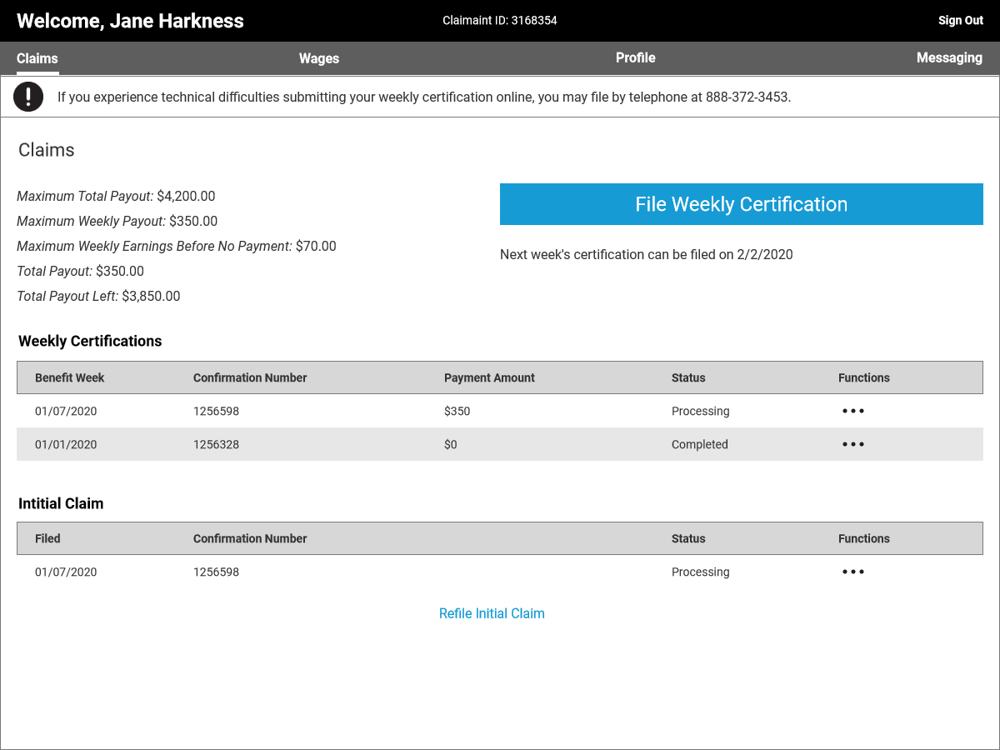
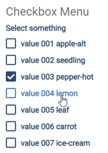
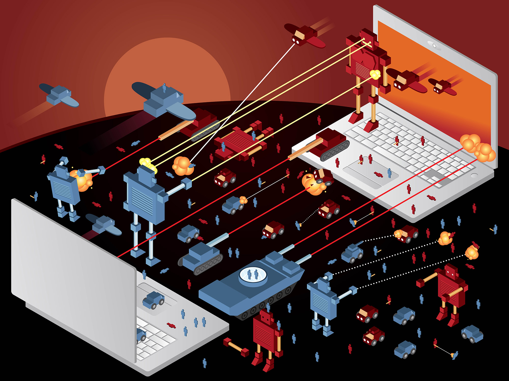

---
hide:
  - navigation
  - toc
glightbox: false
---

# Featured Examples

-   

    ## NC Division Of Employment Security
    
    Redesigned the North Carolina's Division of Employment Security unemployment application as a portfolio sample project.

    **Enterprise**{.chip-feature .project} **UX**{.chip-feature .design} **Axure**{.chip-feature .dev} **Site Rebuild**{.chip-feature .project} **Not Real**{.chip-feature .warning}
    
    [View more on this project :octicons-arrow-right-24:](./nc-des/index.md)

-   

    ## React UI

    Created a small scale design system of UI elements in React.

    **React**{.chip-feature .dev} **Design System**{.chip-feature .design} **UI**{.chip-feature .design} 

    [View more on this project :octicons-arrow-right-24:](./react-ui/index.md)

# Real World Projects

-   

    ## OpenDash360

    On demand and in person cyber-training using virtual machines and integrated training partners.

    **Enterprise**{.chip-feature .project} **Angular**{.chip-feature .dev} **Figma**{.chip-feature .design} **Tech Writing**{.chip-feature .design} 

    [View the website :octicons-arrow-right-24:](https://theuki.com/workforce-applications-dod8140)

-   

    ## Social Media Environment and Internet Replication

    Information warfare training in a simulated real world environment.

    **Enterprise**{.chip-feature .project} **React**{.chip-feature .dev} **Figma**{.chip-feature .design}

    [View the website :octicons-arrow-right-24:](https://www.smeir.net/)

-   

    ## S1000D Publishing Software

    Authoring and publishing of airline maintenance documentation. A project of Boeing Spectrum.

    **Enterprise**{.chip-feature .project} **Angular**{.chip-feature .dev} **Adobe**{.chip-feature .design} **Design System**{.chip-feature .design} 

    [View the website :octicons-arrow-right-24:](https://services.boeing.com/maintenance-engineering/technical-data-services/technical-data-software-spectrum)

