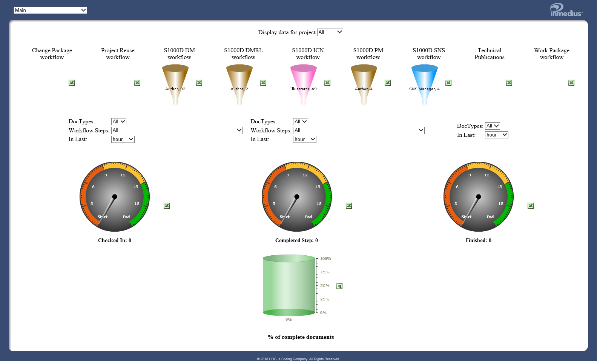
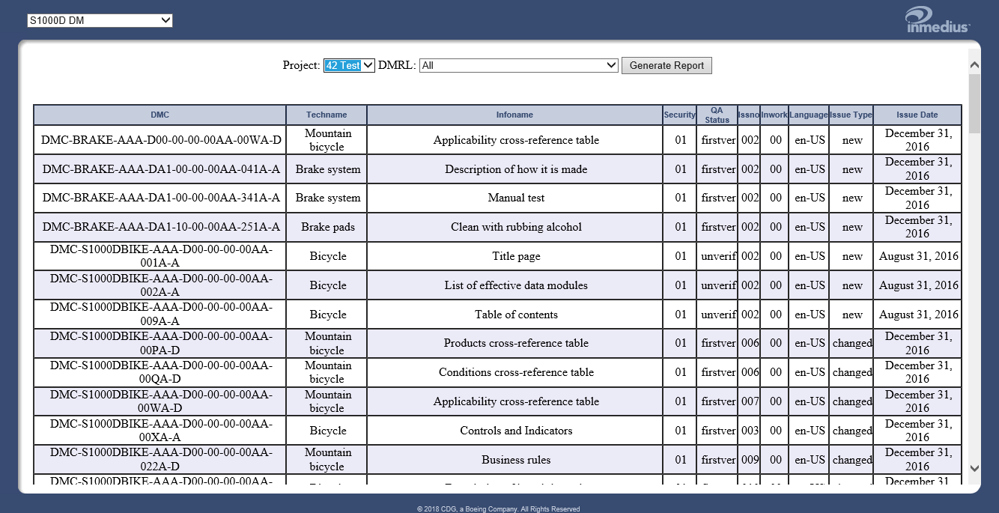
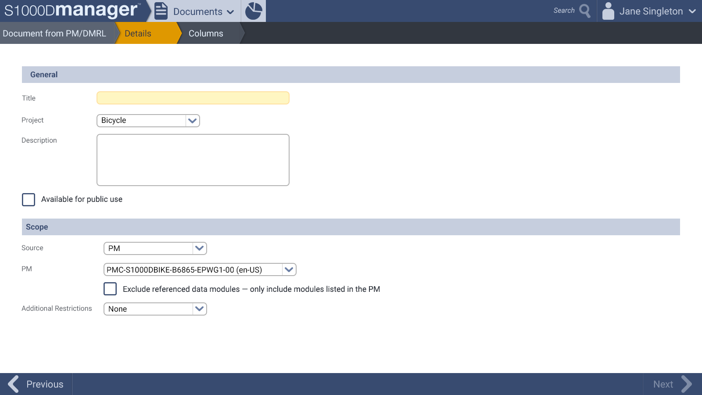
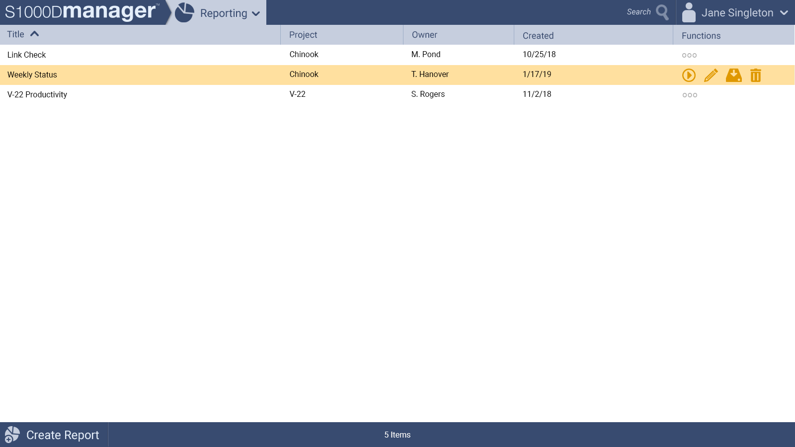

# Reporting for Boeing S1000Dmanager

## Background

[Boeing S1000Dmanager](https://www.boeingservices.com/boeing-spectrum/) is a document management tool that supports sending technical documents (like aircraft maintenance documentation) through workflows as they are authored so they can be quality checked and then published. These documents are grouped by project and can number in the thousands.

Managers who oversee these projects complete weekly reports to check on the status of document changes from their charges. These managers take the data and send it upstream to their managers to report on the health of the project's authoring.

## The Problem

The system currently allows for a fix set of 10 reports, added by default to the system. These reports ran on request.

When requesting new reports, managers had to come to the S1000D product team to get them developed and added to the application (a process that can take up to a year, depending on release schedule) or use a technical scripting software to retrieve the data out of the database, which requires a lot of technical knowledge.

- <figure markdown="span">
      
    <figcaption>Old Dashboard</figcaption>
  </figure>

- <figure markdown="span">
      
    <figcaption>Old Dashboard sub screen</figcaption>
  </figure>

## Understanding the Users

User research sessions were held to interview the users to get an idea of how they were using the reporting system in hopes of solving the problem. This included questions like:

- Why these reports?
- How often are they run?
- Who runs them?
- Do you have other reports you need to run?
- What are you trying to do with the data?

Through these sessions, I found that the main users were manager level employees who needed status reports to send up the chain of command. They needed a quick way to get a report to use in their status updates and were often sending the same set of reports up every week.

To run these reports, a manager must log into the system and run it on command, and often, the reports could take a long time to process, so they would start it up at end of day, and come back for it the next morning.

The current set of reports did not encompass all the data points they needed, hence the request for new reports to be added to the system.

## Final Design

Managers now have a robust, flexible reporting system that is future proofed and significantly reduces the time required to get a new report as they no longer have to ask and wait on the development team to implement them. This also frees up the development team to work on other things.

Instead of fixed reports with fixed data queries, they could make reports on their own through the UI at will, which allowed them to select any fields in the database they needed as well as run excel like functions against that data (e.g. “Column B” is the result of if “Column A” is greater than 5 and if so, reads out “TRUE”).

Additionally, they can now schedule reports. So now reports taking a long time to run, can be scheduled to run weekly, starting in the evening, and the report would be ready for them in the morning.

Functionality was kept so advanced users who wanted to create more advanced reports through the technical scripting software could still do so.

The final contract deliverable was to develop the reporting system’s Final Design as well as additional pre-installed reports per each request in the contract.

[View full mockup image set](./mockups.md)

- <figure markdown="span">
      
    <figcaption>Create Report screen wizard start</figcaption>
  </figure>

- <figure markdown="span">
      
    <figcaption>Create Report screen wizard steps</figcaption>
  </figure>

<!--
- <figure markdown="span">
      
    <figcaption>Reporting screen with row item hovered</figcaption>
  </figure>
--->

