---
hide:
  - toc
---

# Reporting for Boeing S1000Dmanager

## Mockups

<!-- Inbox --->

- <figure markdown="span">
    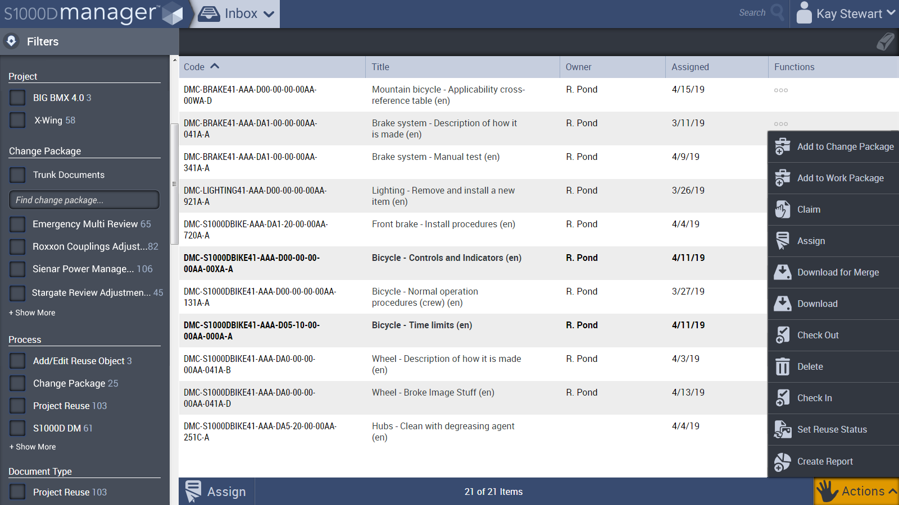
    <figcaption>Create Report access point from Inbox screen</figcaption>
  </figure>

<!-- Create Report Workflow --->

- <figure markdown="span">
    
    <figcaption>Create Report screen - Wizard Start</figcaption>
  </figure>

- <figure markdown="span">
    
    <figcaption>Create Report screen - Wizard details step</figcaption>
  </figure>

- <figure markdown="span">
    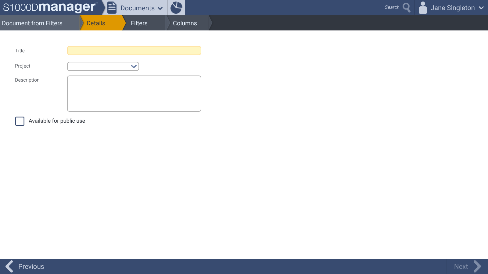
    <figcaption>Create Report screen - Wizard details step</figcaption>
  </figure>

- <figure markdown="span">
    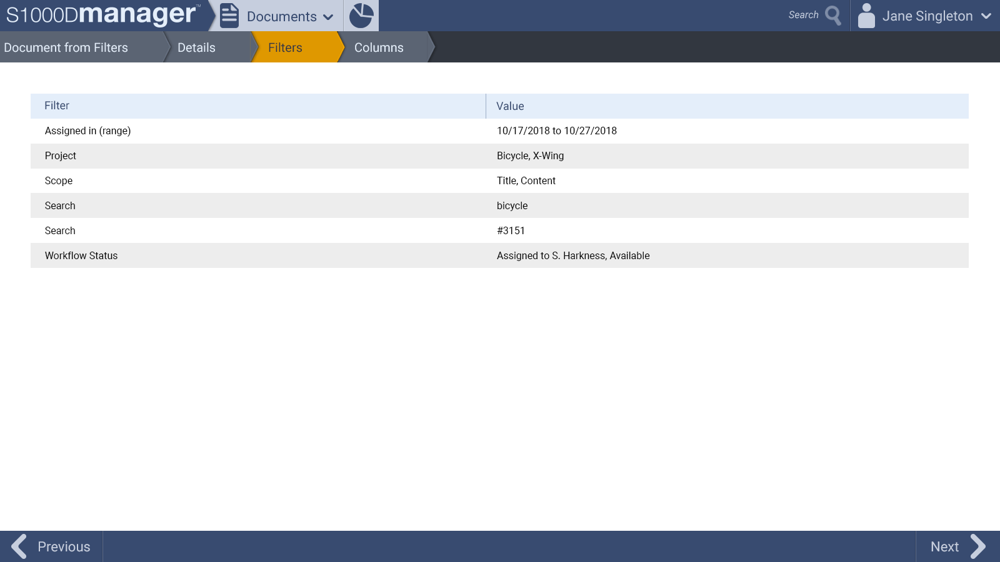
    <figcaption>Create Report screen - Wizard add filters step</figcaption>
  </figure>

- <figure markdown="span">
    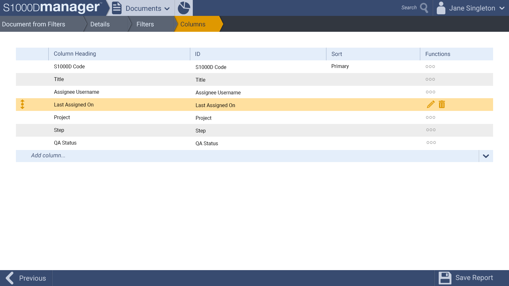
    <figcaption>Create Report screen - Wizard add columns step</figcaption>
  </figure>

<!-- Create Report Edit --->

- <figure markdown="span">
    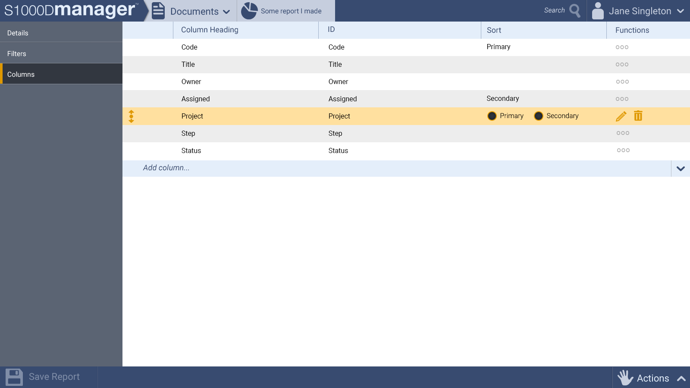
    <figcaption>Create Report screen with row item </figcaption>
  </figure>

- <figure markdown="span">
    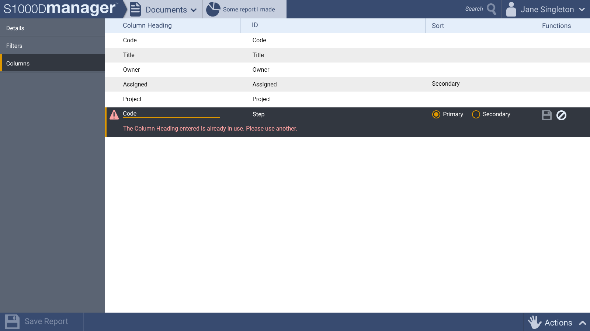
    <figcaption>Create Report screen with invalid row item</figcaption>
  </figure>

- <figure markdown="span">
    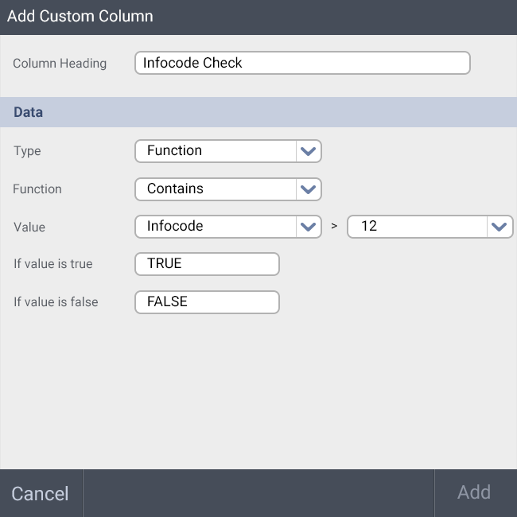
    <figcaption>Dialog to edit a custom column</figcaption>
  </figure>

- <figure markdown="span">
    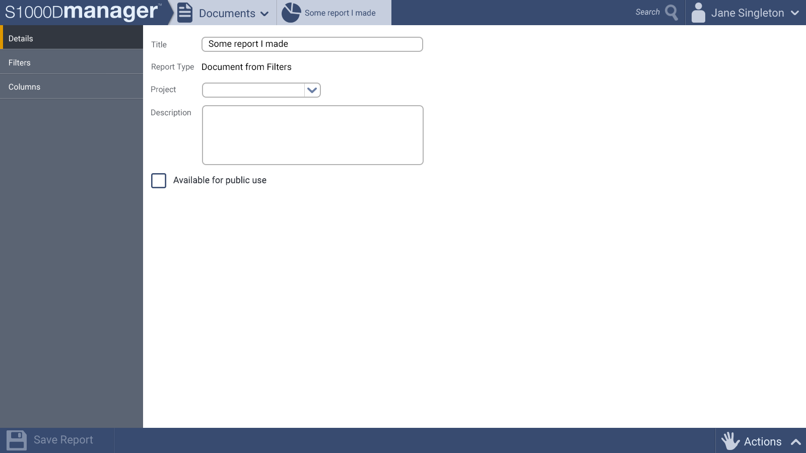
    <figcaption>Create Report screen - edit filters</figcaption>
  </figure>

- <figure markdown="span">
    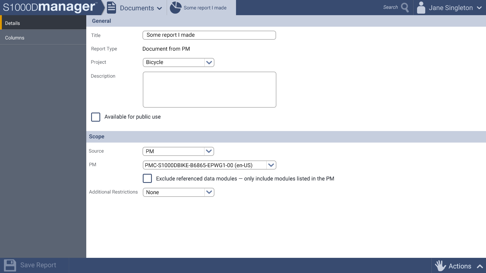
    <figcaption>Create Report screen for a Publication Module</figcaption>
  </figure>

<!-- Reporting --->

- <figure markdown="span">
    
    <figcaption>Reporting screen with row item hovered</figcaption>
  </figure>

- <figure markdown="span">
    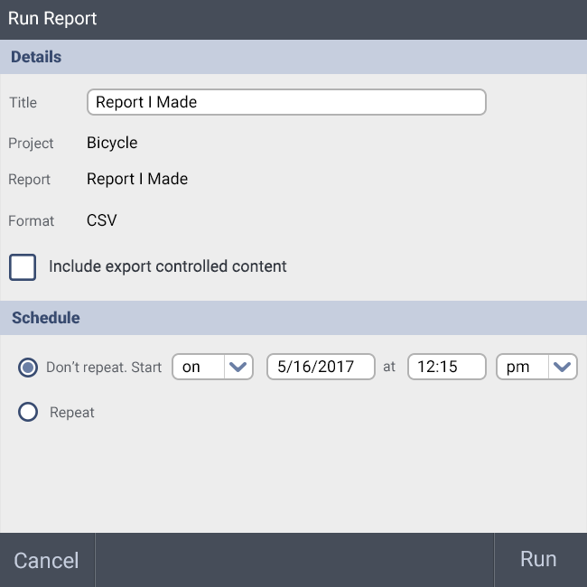
    <figcaption>Run Report dialog</figcaption>
  </figure>

<!-- Activity Monitor --->

- <figure markdown="span">
    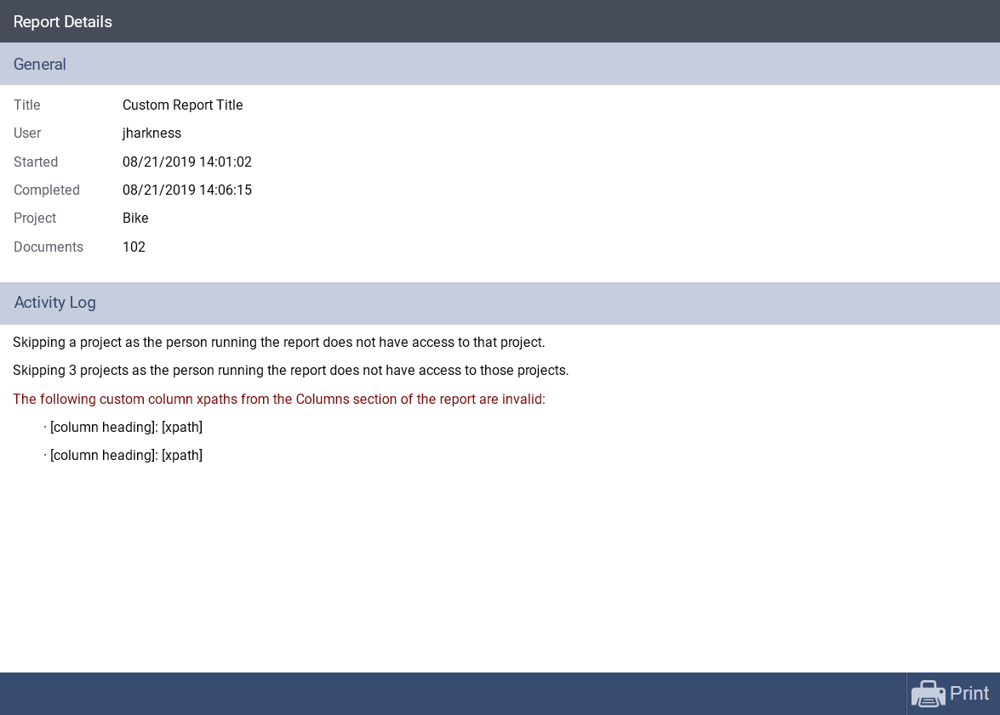
    <figcaption>Activity Monitor Details screen</figcaption>
  </figure>

