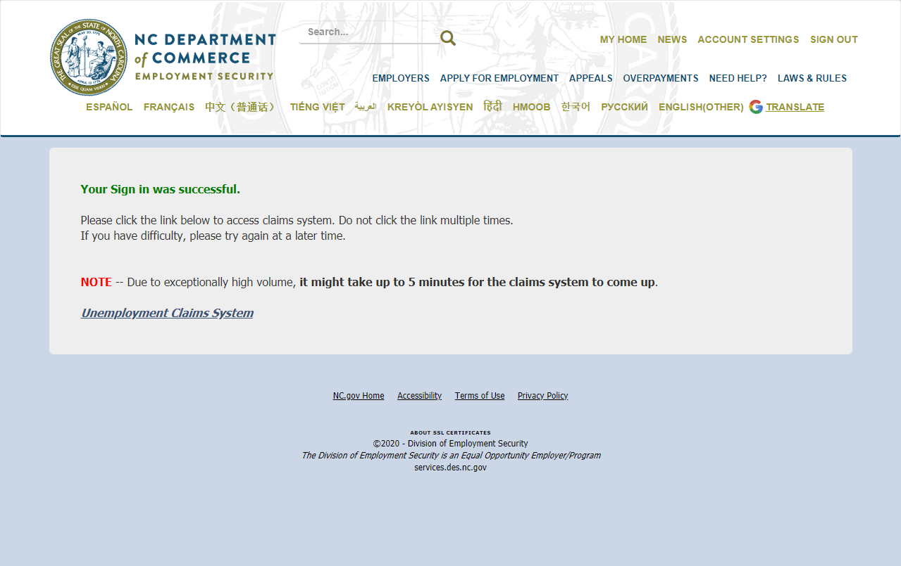
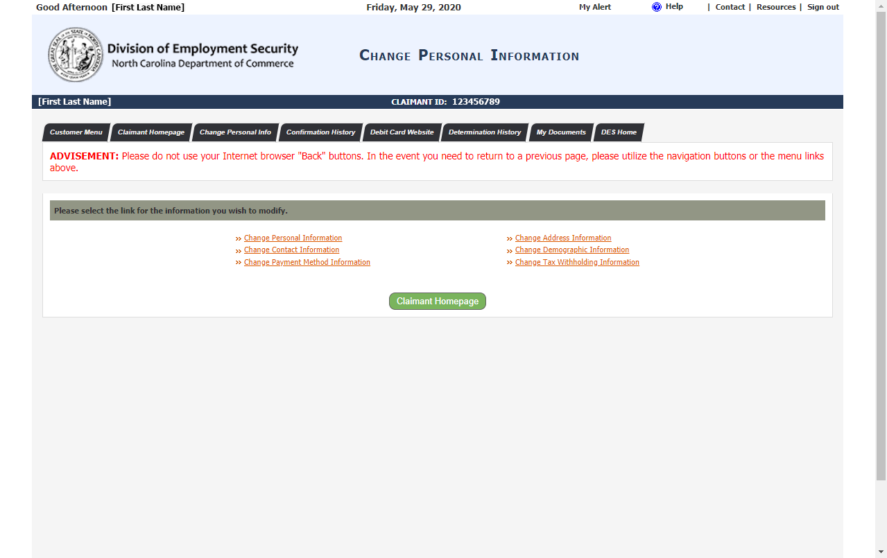
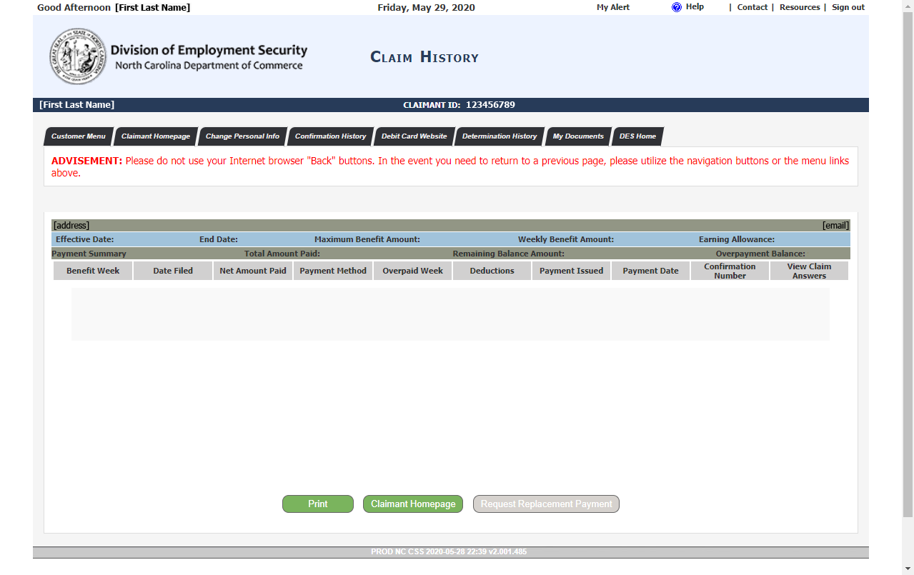
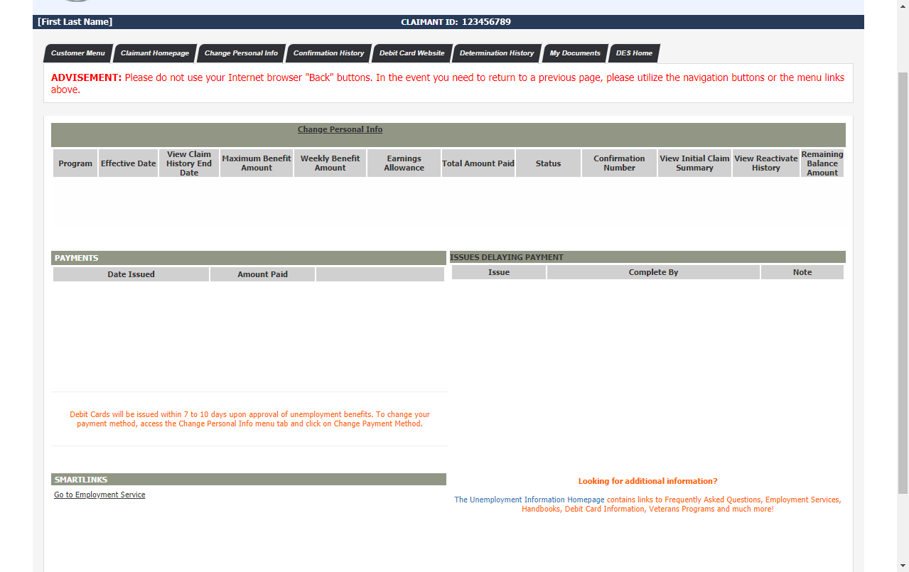
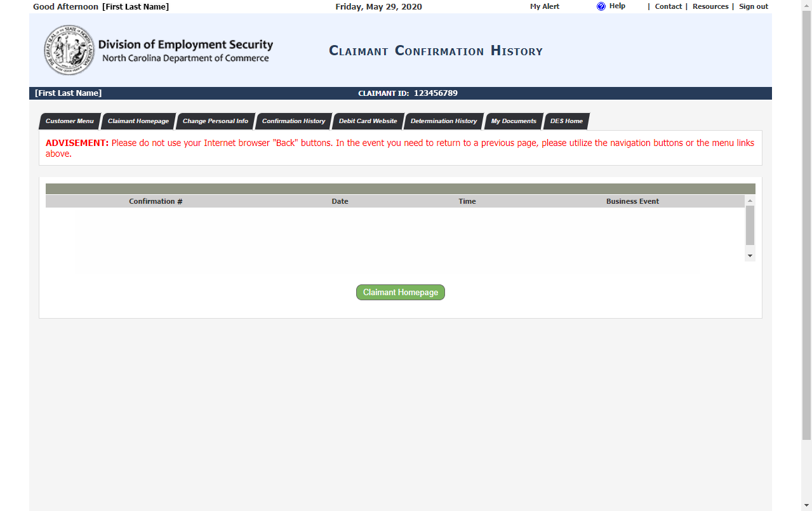
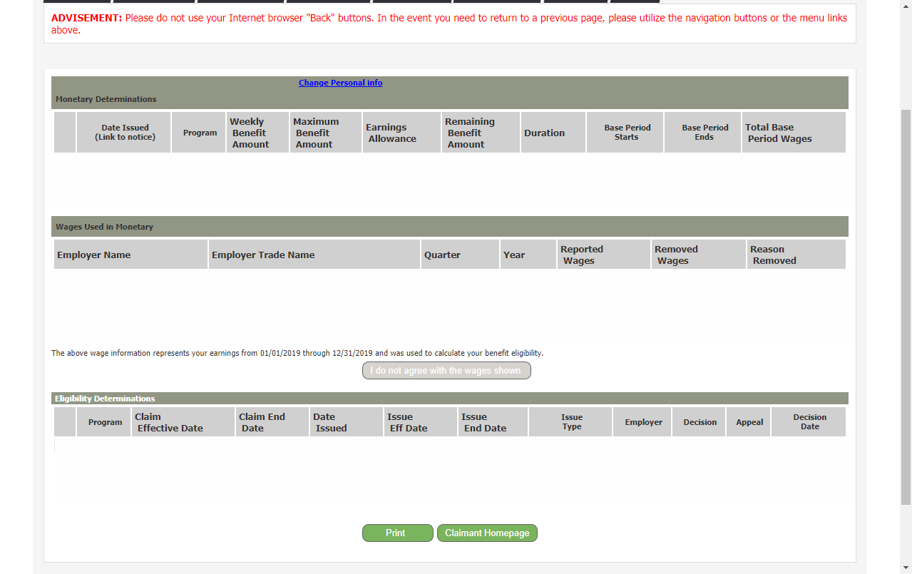
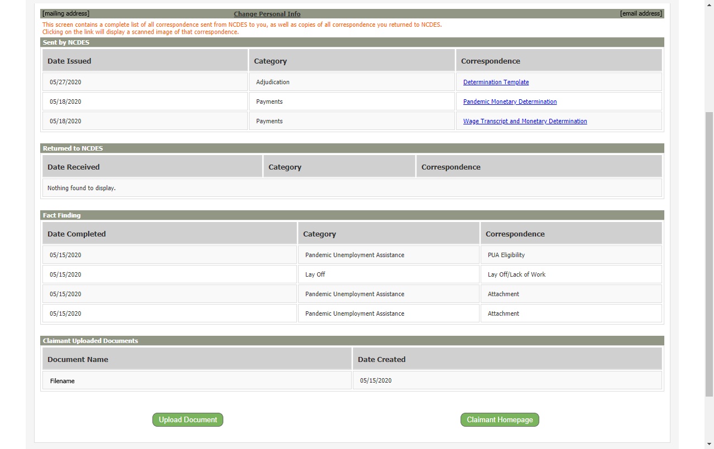

---
hide:
  - toc
---

# NC Division Of Employment Security

## Analysis

- <figure markdown="span">
    
    <figcaption>Sign In screen</figcaption>
  </figure>

- <figure markdown="span">
    
    <figcaption>Sign In - Success screen</figcaption>
  </figure>

- <figure markdown="span">
    
    <figcaption>Change Personal Info screen</figcaption>
  </figure>

- <figure markdown="span">
    
    <figcaption>Claim History screen</figcaption>
  </figure>

- <figure markdown="span">
    
    <figcaption>Claimant Homepage screen</figcaption>
  </figure>

- <figure markdown="span">
    
    <figcaption>Confirmation History screen</figcaption>
  </figure>

- <figure markdown="span">
    
    <figcaption>Determination History screen</figcaption>
  </figure>

- <figure markdown="span">
    
    <figcaption>File Claim screen</figcaption>
  </figure>

- <figure markdown="span">
    
    <figcaption>My Documents screen</figcaption>
  </figure>

