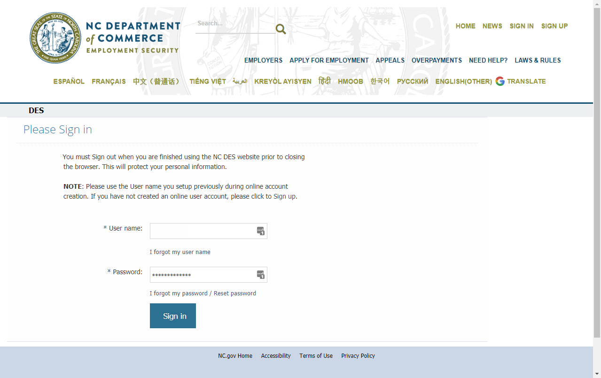
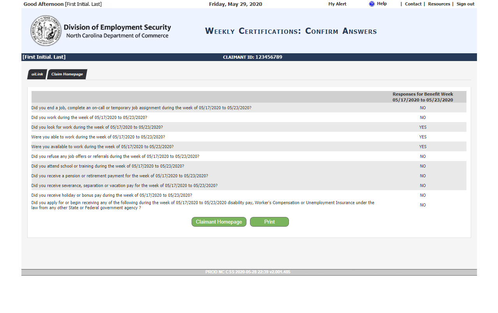
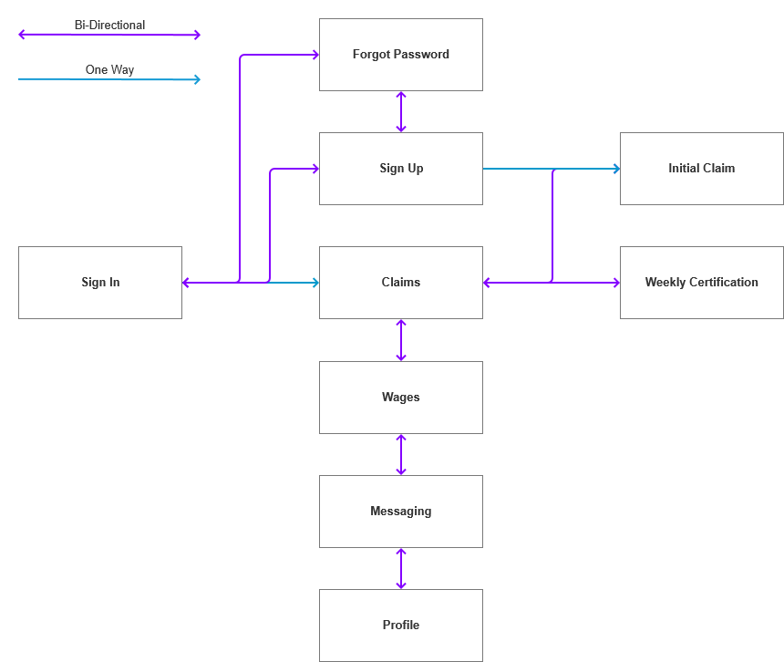

# NC Division Of Employment Security

!!! example "Example Project"

    Project is a portfolio example project.

## Background

I needed a sample project for my portfolio, and my recent experience with the NC Division of Employment Security's web application for filing unemployment claims caused me to try and redesign it.

Web Application: [North Carolina's Division of Employment Security](https://fed.div.des.nc.gov/ofis/citizen/pages/public/Login.aspx){target="_blank"}

!!! note

    The website has undergone a redesign since these screenshots were taken and are no longer accurate of the live site.

[View full analysis image set](./analysis.md)

- <figure markdown="span">
      
    <figcaption>Sign In screen</figcaption>
  </figure>

- <figure markdown="span">
      
    <figcaption>File Claim screen</figcaption>
  </figure>

## The Problem

There are are a few usability issues with the site which include a short list of:

- Too many clicks to get to relevant information
- No clear understanding of site hierarchy
- Poor accessibility implementation, especially in regards to color

## Understanding the Users

The users of the site are the general population of North Carolina. Their main goal for coming to the site will likely be two fold:

- Apply for unemployment
- Check the status of unemployment application and payment

## Design In Progress

The design has not been completely finalized; however black & white wireframes can be viewed as both an Axure prototype and still images.

The main focuses for the design is to give easier access to Weekly Certifications and their status as well as larger target areas and clearer UI sections.

[View full wireframe image set](./wireframes.md)
[View prototype](https://projects.digitalkate.net/nc-des-axure){target="_blank"}

- <figure markdown="span">
      
    <figcaption>Flow chart (new workflow)</figcaption>
  </figure>

- <figure markdown="span">
      
    <figcaption>Claims screen</figcaption>
  </figure>

## What’s Next

Next is to finish up the designs and do some polishing as well as add interactivity. Areas of improvement include:

- Updated navigation: still weak as far as presenting site hierarchy
- Forms: need validation information, validation feedback designs, and cleaner widgets for dates/numbers

Also the designs need to be validated, so user testing in groups of each of the four main site areas: Navigation, Initial File, Weekly Certification, and Profile.

After that, convert them to mockups to add color and styles.
