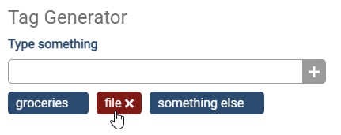
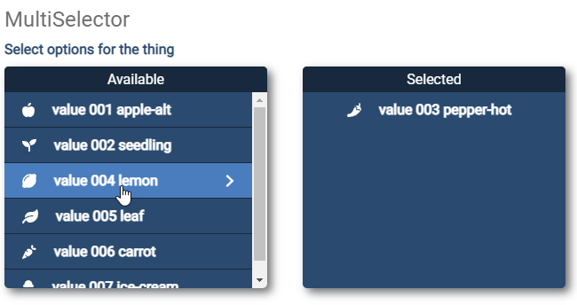

# React UI

A small design system of UI elements created in react as a sample project for this portfolio.

[View the Elements](http://projects.digitalkate.net/react-widgets){target="_blank"}

[See the Code in GitHub](https://github.com/aoide/react-widgets/tree/release/version-1.0){target="_blank"}

- <figure markdown="span">
    
    <figcaption>Tag Generator UI element with item hovered</figcaption>
  </figure>

- <figure markdown="span">
    
    <figcaption>Multiselect UI element with item hovered</figcaption>
  </figure>

